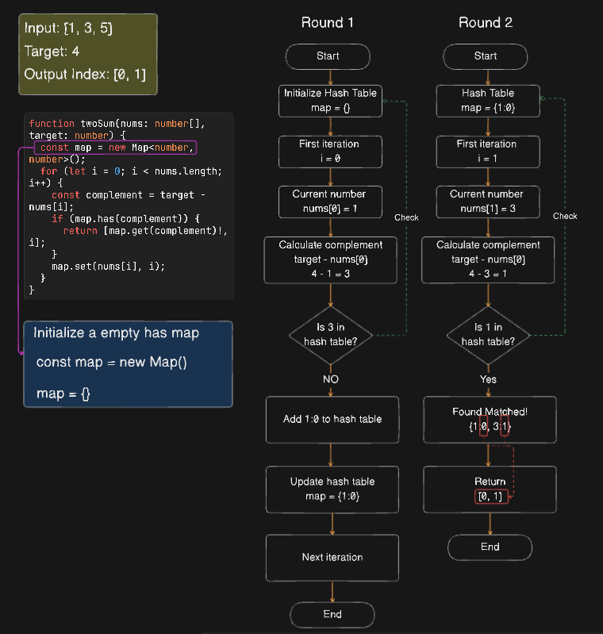
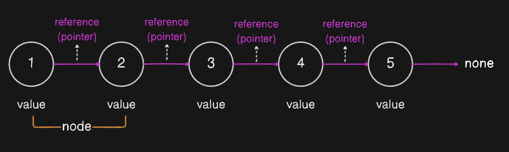
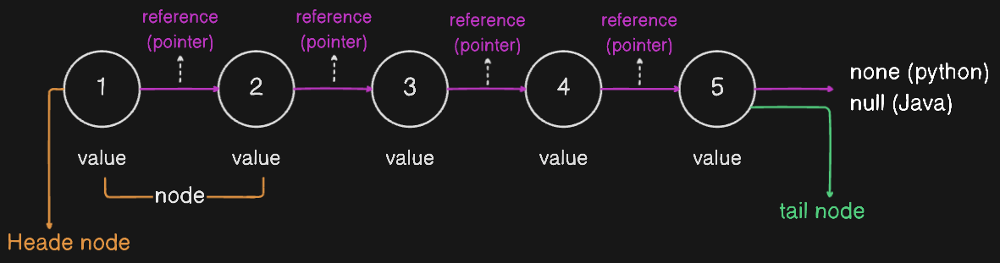

# List and Linked List

## Table of Contents

- [List](#list)
  - [Memory size of an array](#memory-size-of-an-array)
  - [Accessing Elements](#accessing-elements)
  - [Life Analogy](#life-analogy)
  - [LeetCode question for Array: Two Sum](#leetcode-question-for-array-two-sum)
- [Linked List](#linked-list)
  - [Node](#node)

### List

An array is a linear data structure that stores elements in contiguous memory locations. Different programming languages provide different implementations of arrays, for example in Python, we have lists, in JavaScript, we have arrays, etc.

In JavaScript, an array is a list-like object that provides a way to store different types of elements and it is dynamically resizable.

```javascript
// Pure string array
const list = ["apple", "banana", "cherry", "date", "elderberry"];

// Mixed type array
const list = ["apple", 1, true, { name: "John Doe" }, [1, 2, 3]];
```

We can intialize an array with a fixed size and fill it with a default value using the `Array` constructor and the `fill` method, if no initial value is provided, the default value is `0`

```javascript
const list = new Array(5).fill(0);
console.log(list); // [0, 0, 0, 0, 0]
```

#### Memory size of an array

In JavaScript, the size of an array is not fixed, hence the size can be vary depending on the type of data stored. Below is the general memory size of each data type.

- `Number`: 8 bytes (64 bits)
- `String`: 2 bytes per character (UTF-16)
- `Boolean`: 1 byte
- `Objects and Arrays`: Depending on its contents
- `Null and Undefined`: Don't occupy any memory, just a reference to the memory location which typically takes 4 bytes or 8 bytes depending on the system architecture

#### Accessing Elements

We can access elements in an array using the index of the element. The index of the first element is `0`, the index of the second element is `1`, and so on.

```javascript
const list = ["apple", "banana", "cherry", "date", "elderberry"];
console.log(list[0]); // apple

// Accessing the last element
console.log(list[list.length - 1]); // elderberry

// Accessing the second last element
console.log(list[list.length - 2]); // date
```

Accessing any elements in an array usually take `O(1)` time complexity.

#### Life Analogy

We often see UI like a list of items in a shopping cart, a list of items in a to-do list, or a list of travel destinations like Airbnb. These lists are usually implemented using an array data structure.


Let's try to implement it.

#### LeetCode question for Array: Two Sum

- [Two Sum](https://leetcode.com/problems/two-sum/)

Given an array of integers `nums` and an integer `target`, return indices of the two numbers such that they add up to `target`.

for example:

```plaintext
Input: nums = [2,7,11,15], target = 9
Output: [0,1]

Input: nums = [3,2,4], target = 6
Output: [1,2]
```

##### Solutions

- Use double loop to find the answer, time complexity is `O(n^2)` (Check code of `two_sum_approach_1.ts`)
- Use hash table to store the value and index, time complexity is `O(n)` (Check code of `two_sum_approach_2.ts`)

#### Visualizing solution of using hash table



---

### Linked List

As we already know that if we want to install memory using array, we need to install memory in a contiguous memory location, if we have a large arrays, it would be hard to find a contiguous memory space, in this situation **linked list** comes in handy.

#### Each element is a node object

Linked list is also a linear data structure, its element is a node object, and nodes are interconnected through **references (pointers)**. A reference (pointer) is a address of the memory location where the next node is stored, we can access memory in a non-contiguous memory location.



- The first node is called **head node**.
- The last node is called **tail node**.
- In language like C or C++, the reference is also called **pointer**.



#### Occupy more memory

Because a linked list is a collection of nodes, and each node contains a reference to the next node, it occupies more memory than an array.
