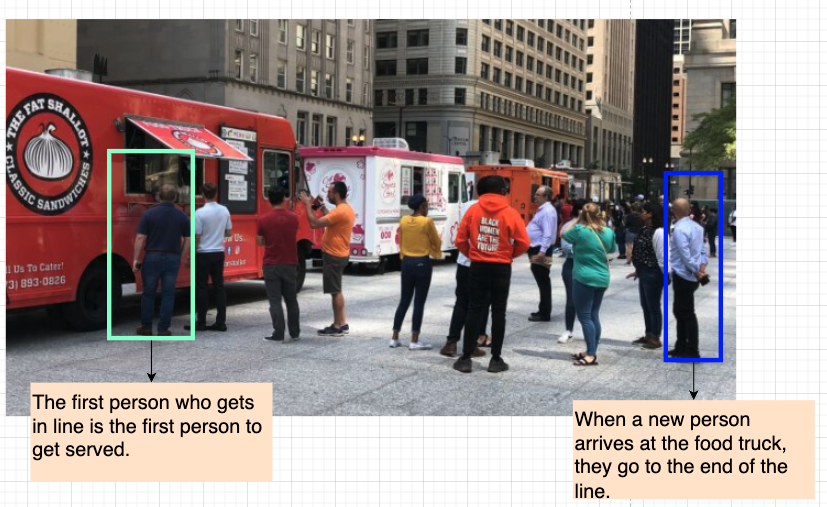
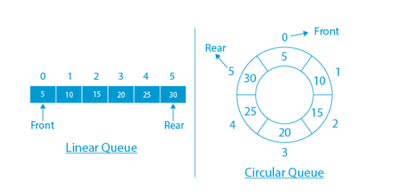
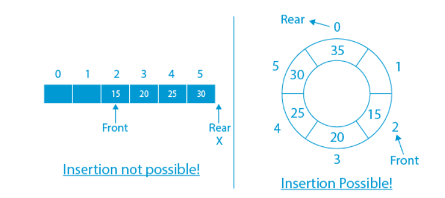

# Stack and Queue

## Table of Contents

- [Stack](#stack)
  - [Life Analogy](#life-analogy)
  - [Stack Data Structure in software development](#stack-data-structure-in-software-development)
  - [Stack Operations](#stack-operations)
  - [Browser History Navigation](#browser-history-navigation)
  - [Basic Implementation](#basic-implementation)
  - [LeetCode question for stack: Valid Parentheses](#leetcode-question-for-stack-valid-parentheses)
  - [Time complexity Analysis (Big O)](#time-complexity-analysis-big-o)
- [Queue](#queue)
  - [Life Analogy](#life-analogy-1)
  - [Queue Data Structure in software development](#queue-data-structure-in-software-development)
  - [Basic Implementation](#basic-implementation-1)

### Stack

Stack is a linear data structure that follows the **LIFO** (Last In First Out) principle. The last element added to the stack will be the first element to be removed.

#### Life Analogy

- A pile of books

You are a book lover, and enjoy buying books, but you don't have enough space in your book shelf, one day, you decide to stack the books on top of each other, but the one you want to read is the one you put on bottom, so you have to remove all the books on top to get the one you want.


So you begin to move the books one by one until you get the one you want.

Stack data structure is like this, the last book you add to the stack will be the first book you remove.

- In Accounting

LIFO is used in accounting to value inventory, the cost of goods sold (COGS) is calculated based on the last item that was added to the inventory.


#### Stack Data Structure in software development

- Browser History Navigation
- Undo operation in text editors

#### Stack Operations

- **Push**: Add an element to the top of the stack
- **Pop**: Remove an element from the top of the stack
- **Peek**: Get the top element of the stack without removing it 👀

---

#### Browser History Navigation

When visit a website, every page we visit is added to the stack.


When we click the back button, essentially we are popping the last page we visited and go back to the previous page.


---

#### Basic Implementation

In JS or TS, there no built-in stack data structure, but we can use an array or linked list to simulate a stack.

```typescript
// Use array to create stack

const stack: number[] = [];
// This can be any type, string[], boolean[]...

// Start pushing some numbers

stack.push(1);
stack.push(3);
stack.push(7);

// Peeking elements
const peek = stack[stack.length - 1];

// Check size
const stackSize = stack.length;

// Check if stack is empty
const isStackEmpty = stackSize === 0;

console.log("stack", stack);
console.log("peek", peek);
console.log("stackSize", stackSize);
console.log("isStackEmpty", isStackEmpty);
```


---

#### LeetCode question for stack: Valid Parentheses

According to this task, we need to implement a function that accept a string as input, and return a boolean value to indicate whether the input string is valid parentheses.

In this task, let's go through the idea of using stack to solve this problem.

##### What makes a valid parentheses?

It will look like `()` or `[]` or `{}` or a combination of them, like `([])` or `{()}`, even nested like `({[]})`.

Try to look the pattern, we can identify that a valid parentheses needs to have a opening bracket followed by a closing bracket, the left one is always the opening bracket (`(`), and the right one is always the closing bracket(`)`).

##### Why use stack?

Stack is a LIFO data structure, we can push and pop elements from the top of the stack, therefore, we can loop through the string, when we meet a opening bracket, we can push to the stack, and when we meet a closing bracket, we can check if the top element of the stack is the corresponding one, if it is, we can pop from the stack, if not, we can return false.

If the stack is not empty after the loop, we know that there's some brackets are not closed, we can return false.

#### Time complexity Analysis (Big O)

#### Calculating Big O

When it comes to analyzing the time complexity of an algorithm, there're several things that we don't need to consider:

1. Constant doesn't matter
2. Smaller terms don't matter
3. Logarithmic terms don't matter

And we only think about the worst case scenario, take this task as an example, we need to loop through the input string, and for each character, we need to push and pop from the stack, we know that there're several operations that we need to do, but we only care about the most expensive one, which is the loop, so the time complexity of this task is `O(n)`, `n` is the length of the input string.

So the time complexity of this task is `O(n)`.

---

### Queue

Queue is another linear data structure that follows the **FIFO** (First in, First out) principle. The first element added to the queue will be the first element to be removed.

#### Life Analogy

- A line of people in front of a food truck.



**FIFO** describe the behavior of the person inside the highlighted box, he will be the first one to get the food and leave the line.

There're several operations that we can do with a queue:

- **Enqueue**: Add an element to the end of the queue, like the person inside the blue box, he's the last one to join the line, and whoever behind him will be added after him.

- **Dequeue**: Remove an element from the front of the queue,imagine that whoever gets the food will leave the line.

- **Peek**: Get the front element of the queue without removing it. Could the chief of the food truck wants to share candies with some of the kids in the line with their families, so the assistant will check kids' position in the line without removing them.

Here is a table to help you visualize the operations:

| Operation | description                                            | Time Complexity |
| --------- | ------------------------------------------------------ | --------------- |
| push      | Add an element to the end of the queue                 | O(1)            |
| pop       | Remove an element from the front of the queue          | O(1)            |
| peek      | Get the front element of the queue without removing it | O(1)            |

#### Queue Data Structure in software development

- Task scheduling
- 💡 Asynchronous Processing (Important if you are a JS developer)
- Printers

#### Basic Implementation

In JS or TS, there no built-in queue data structure, but we can use an array or linked list to simulate a queue.

```typescript
// Use array to create queue

const queue: number[] = [];

// Start adding some numbers

queue.push(1);
queue.push(3);
queue.push(7);

// Dequeue elements
const firstElement = queue.shift();

// Peeking elements
const peek = queue[0];

// Check size
const queueSize = queue.length;

// Check if queue is empty
const isQueueEmpty = queueSize === 0;

console.log("queue", queue); // [3, 7]
console.log("firstElement", firstElement); // 1
console.log("peek", peek); // 3
console.log("queueSize", queueSize); // 2
console.log("isQueueEmpty", isQueueEmpty); // false
```

#### Circular Queue

What is a circular queue? A circular queue is a queue that wraps around and connects the last element to the first element, below is a diagram to help you visualize the concept.



When we try to dequeue an element from the queue, in linear queue, we move the front pointer to the next element(to the right), but if want to enqueue an element, we know that we need to insert at the end of the queue, but in linear queue, there's no space for us to insert, in this situation, circular queue comes in handy.

Like the shape of a circle, we connect the end of the queue to the front of the queue, so when we try to enqueue an element, we can insert at the end of the queue, if we want to enqueue another element, we can insert at the next position of the last element, and so on.

For example, we want to insert element 35, we can't do this in a linear queue, but in a circular queue, we can insert at the next position of the last element.



##### Advantages of Circular Queue

- Efficient use of memory
- Can be used for both FIFO ans LIFO data structures.
- Better performance than linear queue.

##### Disadvantages of Circular Queue

- Limited capacity, might cause overflow if the queue is full.
- More complex than linear queue.
- Difficult to implement and debug sometimes.

#### How to implement a circular queue?

In circular array, `front` and `rear` need to loop back to the beginning of the array when they reach the end of the array. We can use the modulo operator `%` to achieve this.

##### Modulo Operator

The modulo operator `%` returns the remainder of a division operation, for example, `5 % 3` will return `2`, because `5 / 3` equals `1` with a remainder of `2`.
