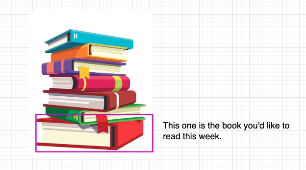
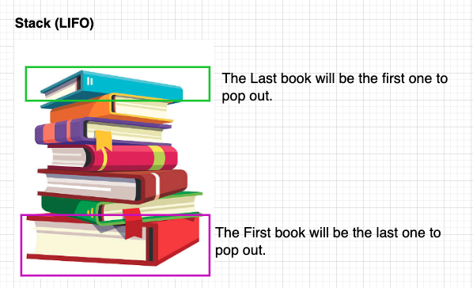
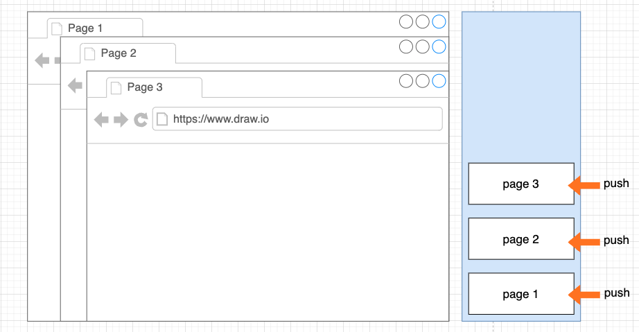
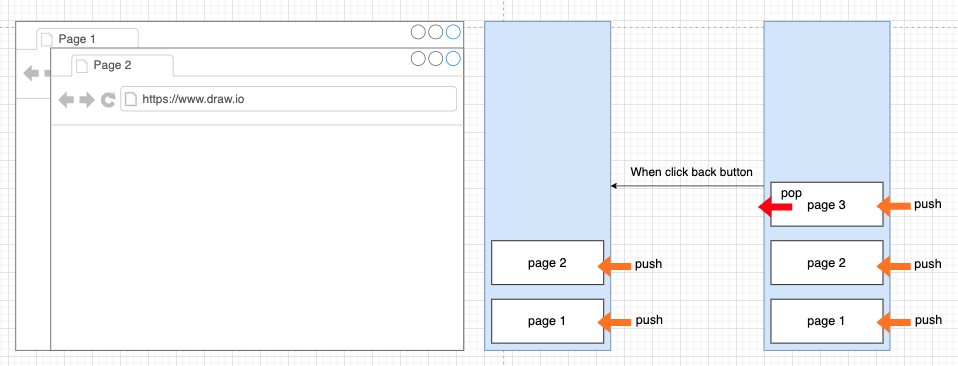
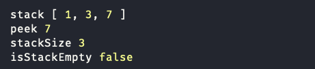

# Stack & Queue

## Stack

Stack is a linear data structure that follows the **LIFO** (Last In First Out) principle. The last element added to the stack will be the first element to be removed.

### Life Analogy

- A pile of books

You are a book lover, and enjoy buying books, but you don't have enough space in your book shelf, one day, you decide to stack the books on top of each other, but the one you want to read is the one you put on bottom, so you have to remove all the books on top to get the one you want.



So you begin to move the books one by one until you get the one you want.

Stack data structure is like this, the last book you add to the stack will be the first book you remove.



### Stack Data Structure in software development

- Browser History Navigation
- Undo operation in text editors

### Stack Operations

- **Push**: Add an element to the top of the stack
- **Pop**: Remove an element from the top of the stack
- **Peek**: Get the top element of the stack without removing it 👀

### Browser History Navigation

When visit a website, every page we visit is added to the stack.



When we click the back button, essentially we are popping the last page we visited and go back to the previous page.



### Basic Implementation

In JS or TS, there no built-in stack data structure, but we can use an array or linked list to simulate a stack.

```typescript
// Use array to create stack

const stack: number[] = [];
// This can be any type, string[], boolean[]...

// Start pushing some numbers

stack.push(1);
stack.push(3);
stack.push(7);

// Peeking elements
const peek = stack[stack.length - 1];

// Check size
const stackSize = stack.length;

// Check if stack is empty
const isStackEmpty = stackSize === 0;

console.log("stack", stack);
console.log("peek", peek);
console.log("stackSize", stackSize);
console.log("isStackEmpty", isStackEmpty);
```


