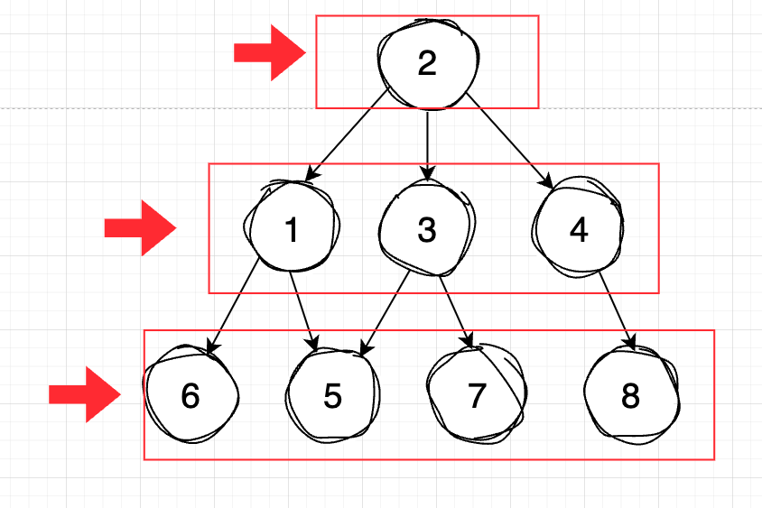

# Tree

## Table of Contents

### Graph in Definition

Graph is an abstract data type, which is consist of a finite set of vertices (also called **nodes** or **points**) and a set of edges (also called **links** or **line**) connecting these vertices.

There are two types of graphs:

- **Directed Graph**: A graph in which the edges have a direction, means you can go from A to B but you can't go from B to A.


- **Undirected Graph**: A graph in which the edges do not have a direction, means you can go from A to B and from B to A.


---

### Tree in Definition

A tree must satisfy the following conditions:

- **Tree is a special type of graph without any cycle (or loop)**.See the image of direct graph above, it shows a cycle, means you can go from A to B, B to C and C to A, so it's not a tree.


- Tree must have **one and only one root node**. Image below shows a tree with two root nodes, so it's not a tree.

- Tree in real life examples:
  - DOM (Document Object Model) in HTML
  - File System


#### Tree Traversal

Tree is a commonly used data structure, there are two ways to do tree traversal:

- Breadth-First Search (BFS)
- Depth-First Search (DFS)
  - Pre-order
  - In-order
  - Post-order

---

#### Breadth-First Search (BFS)

BFS is a traversal algorithm that starts traversing the tree from the root node and explores all the nodes at the present depth before moving on to the nodes at the next depth level.



Take a look at the image above, the BFS traversal of the tree is 2, 1, 3, 4, 6, 5, 7, 8

##### Pseudo code of BFS:

```javascript
BFTT():
  queue.add(root)
  for i from 0 to queue.length:
    currentNode = queue[i]
    for j from 0 to currentNode's children count - 1:
      queue.add(currentNode's child)
```

---

#### Depth-First Search (DFS)

- DFS is a traversal algorithm that process all nodes of a tree by processing the **root**, then recursively processing all subtrees.

- Also known as prefix traversal.

- Method: root -> left -> right

##### Pseudo code of DFS:

```javascript
PREORDER(node):
  write(node)
  for i from 0 to node's children count - 1:
    // Recursive call
    PREORDER(node[i])
```
