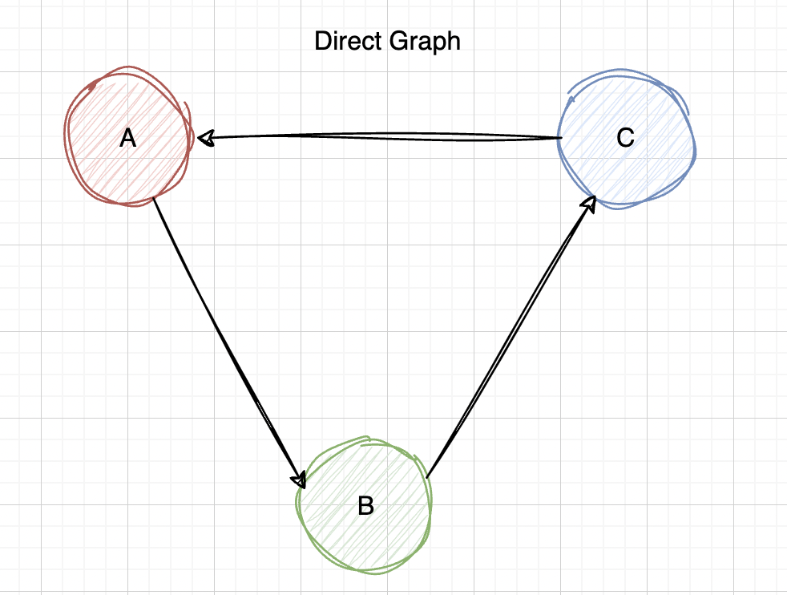
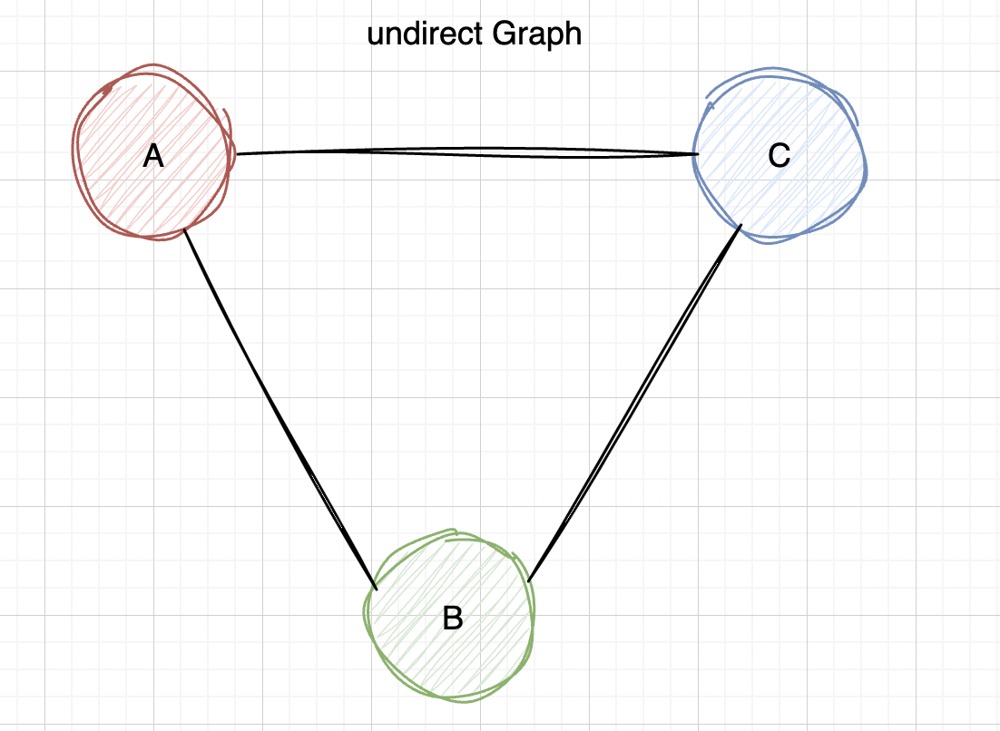
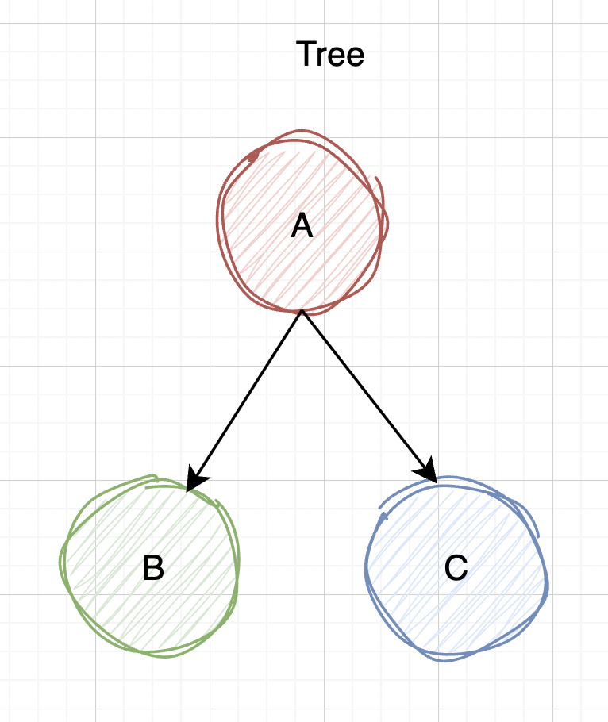
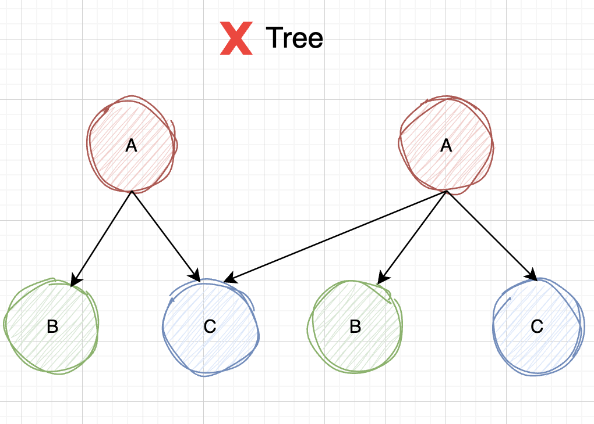

# Tree

## Table of Contents

### Graph in Definition

Graph is an abstract data type, which is consist of a finite set of vertices (also called **nodes** or **points**) and a set of edges (also called **links** or **line**) connecting these vertices.

There are two types of graphs:

- **Directed Graph**: A graph in which the edges have a direction, means you can go from A to B but you can't go from B to A.

- **Undirected Graph**: A graph in which the edges do not have a direction, means you can go from A to B and from B to A.

---

### Tree in Definition

A tree must satisfy the following conditions:

- **Tree is a special type of graph without any cycle (or loop)**.See the image of direct graph above, it shows a cycle, means you can go from A to B, B to C and C to A, so it's not a tree.

- Tree must have **one and only one root node**. Image below shows a tree with two root nodes, so it's not a tree.

